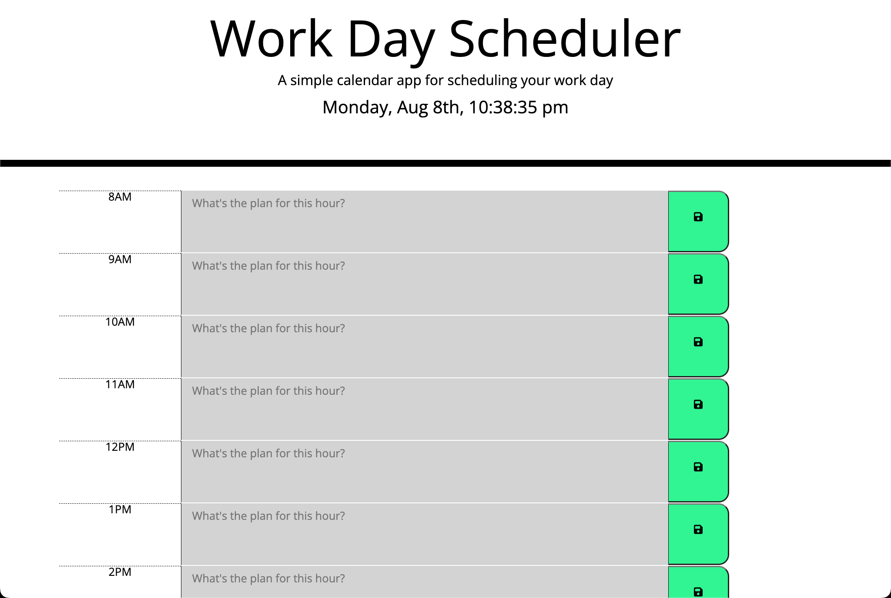
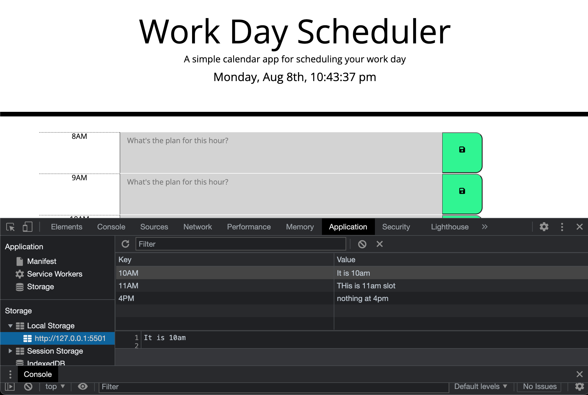

# 05 Third-Party APIs: Work Day Scheduler

## About this project

This is a calendar application that allows a user to save events happening from 8am to 5pm. 

The top clock should show the current date and time from the time you are viewing the page. The calendar should be responsive according to the time of day. If the current hour is between 8am and 5pm, the current hour should be in red. The past time should display in gray and future time (up to 5pm) should appear in green.


## Acceptance Criteria

```md
GIVEN I am using a daily planner to create a schedule
WHEN I open the planner
THEN the current day is displayed at the top of the calendar
WHEN I scroll down
THEN I am presented with timeblocks for standard business hours
WHEN I view the timeblocks for that day
THEN each timeblock is color coded to indicate whether it is in the past, present, or future
WHEN I click into a timeblock
THEN I can enter an event
WHEN I click the save button for that timeblock
THEN the text for that event is saved in local storage
WHEN I refresh the page
THEN the saved events persist
```

The following animation demonstrates the application functionality:


## Screenshots






## URL to launch website

**Please View the Final page here: [View APIs Quiz Website](https://yuyitax.github.io/05-Work-Day-Scheduler/)

---

© 2022 Cristina Yunes -- Yuyitax. All Rights Reserved.
